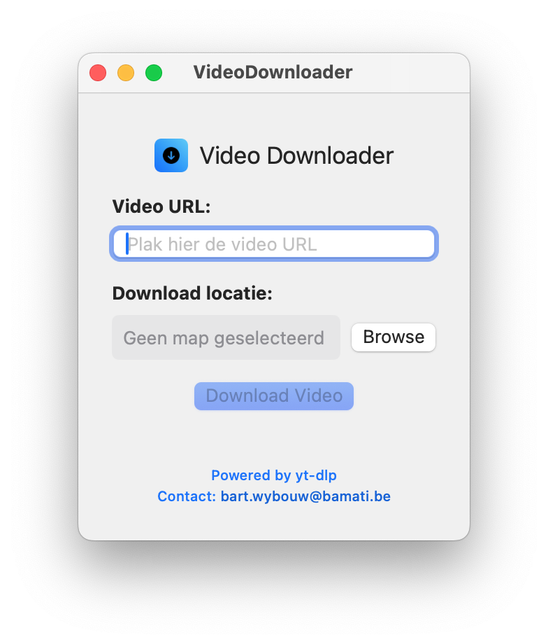

#  Video Downloader App

Een native macOS applicatie gebouwd met SwiftUI om video's te downloaden van verschillende platforms met behulp van yt-dlp.

## ✨ Features

- 🎯 **Native macOS interface** - Gebouwd met SwiftUI
- 📊 **Realtime progress tracking** - Live percentage en snelheidsweergave
- ⏸️ **Download controles** - Pauzeren, hervatten en stoppen
- 📁 **Native folder picker** - Kies eenvoudig waar je bestanden wilt opslaan
- 🌐 **Breed platform support** - Ondersteunt alle yt-dlp compatible websites
- 🚀 **High performance** - Efficiënte downloads met status feedback

## 📱 Screenshots



De app toont:
-  Modern icoon en compacte interface
- URL invoerveld voor video links
- Folder selector met native macOS dialog ("Browse" knop)
- Realtime progress bar met percentage
- Download snelheid en ETA indicators
- Pause/Resume/Stop knoppen tijdens download
- Footer met yt-dlp attributie en contact link

## 📦 Download & Installatie

### 🚀 Gebruikersinstallatie (Aanbevolen)

**Download de nieuwste versie:**
- [VideoDownloader_1.0_Signed.dmg](VideoDownloader_1.0_Signed.dmg) - **Professioneel gesigneerd** (geen Gatekeeper waarschuwingen!)
- [VideoDownloader_1.0.dmg](VideoDownloader_1.0.dmg) - Basis versie (vereist handmatige goedkeuring)

**Installatie stappen:**
1. Download en open de DMG
2. Sleep VideoDownloader.app naar Applications
3. Installeer yt-dlp: `brew install yt-dlp`
4. Start de app vanuit Applications!

### 🛡️ macOS Gatekeeper Waarschuwing

Als macOS een waarschuwing toont dat de app "niet vertrouwd" is:

**Snelle oplossing:**
- Rechtsklik op VideoDownloader.app in Applications
- Kies "Open" en bevestig nogmaals met "Open"

**Of gebruik het meegeleverde script:**
```bash
./sign_app.sh
```

**Alternatief:**
- Apple menu → Systeem Voorkeuren → Beveiliging en Privacy
- Klik "Toch openen" onder Algemeen

---

## 🍎 Apple Developer Code Signing

### Voor distributie zonder Gatekeeper waarschuwingen:

1. **Setup code signing:**
   ```bash
   ./setup_codesigning.sh
   ```

2. **Build signed version:**
   - Open project in Xcode
   - Product → Archive  
   - Export as Developer ID signed app

3. **Create professional installer:**
   ```bash
   ./create_signed_installer.sh
   ```

**Vereist:** Apple Developer Account met Developer ID Application certificate

---

## 🔧 Development Setup

### Vereisten

1. **macOS 12.0+** (Monterey of nieuwer)
2. **Xcode** (voor development)
3. **yt-dlp** geïnstalleerd via Homebrew:
   ```bash
   brew install yt-dlp
   ```

### Build instructies

1. **Clone de repository:**
   ```bash
   git clone https://github.com/jouw-username/VideoDownloader.git
   cd VideoDownloader
   ```

2. **Open in Xcode:**
   ```bash
   open VideoDownloader.xcodeproj
   ```

3. **Build en run:**
   - Selecteer "My Mac" als destination
   - Druk ⌘R om te builden en runnen

### Developer setup (eenmalig)
```bash
sudo xcode-select --switch /Applications/Xcode.app/Contents/Developer
```

## 🚀 Gebruik

1. **Video URL invoeren** - Plak de link van je video
2. **Download locatie kiezen** - Gebruik de native folder picker
3. **Download starten** - Klik "Download Video"
4. **Monitor progress** - Zie realtime voortgang, snelheid en ETA
5. **Controle downloads** - Pauzeer, hervat of stop indien gewenst

## 🌐 Ondersteunde Platforms

De app werkt met alle websites die yt-dlp ondersteunt, inclusief:
- YouTube
- Vimeo
- Twitch
- Twitter
- Instagram
- En [veel meer](https://github.com/yt-dlp/yt-dlp/blob/master/supportedsites.md)

## 🛠️ Technische Details

- **Framework**: SwiftUI
- **Minimum macOS**: 12.0 (Monterey)
- **Architecture**: Universal (Apple Silicon + Intel)
- **Download engine**: yt-dlp
- **Real-time parsing**: Live output processing voor progress updates

## 📝 Development

Het project bestaat uit:
- `VideoDownloaderApp.swift` - App entry point
- `ContentView.swift` - Main UI en download logic
- `VideoDownloader.entitlements` - App permissions
- Web versie beschikbaar in `video_downloader_web.py`

## 🤝 Contributing

Verbeteringen welkom! Open een issue of pull request.

## 📄 License

[Voeg je gewenste license toe]

## 🙏 Credits

- Gebouwd met [yt-dlp](https://github.com/yt-dlp/yt-dlp)
- SwiftUI voor de native macOS interface